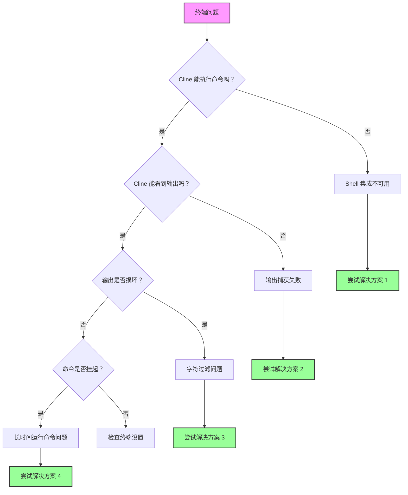

本指南帮助您解决 Cline 中的终端集成问题。终端集成对于 Cline 执行命令和读取其输出至关重要，使其能够理解错误、测试结果和命令响应。

<Tip>
	如果您遇到终端问题，请尝试在 Cline 设置中切换到更简单的 shell，如 `bash`，在"终端设置"下

    这解决了大多数终端集成问题。

</Tip>

## 快速诊断流程图

按照此流程图快速识别您的问题：



## 常见问题和快速解决方案

### 1. Shell 集成不可用

**症状：**

-   消息："Shell 集成不可用"
-   命令执行但 Cline 无法读取输出
-   终端手动工作正常但与 Cline 不工作

**快速解决方案：**

#### macOS

-   **切换到 bash**

    1. 转到 Cline 设置
    2. 左键点击**"终端设置"**标签
    3. 导航到**"默认终端配置文件"**并从下拉菜单中选择**"bash"**

-   **临时禁用 Oh-My-Zsh**：

    1. 如果使用 zsh，在终端中输入 `mv ~/.zshrc ~/.zshrc.backup`
    2. 重启 VSCode

-   **设置环境**：
    1.a 对于 Zsh 用户，使用以下 Zsh 命令之一编辑您的 shell 配置文件：

          - `nano ~/.zshrc`
          - `vim ~/.zshrc`
          - `code ~/.zshrc`

    1.b 对于 Bash 用户

          - nano ~/.bash_profile

    2. 将以下内容添加到您的 shell 配置：`export TERM=xterm-256color`
    3. 保存您的配置

#### Windows

-   **使用 PowerShell 7**

    1. 从 Microsoft Store 安装
    2. 转到 Cline 设置
    3. 左键点击**"终端设置"**标签
    4. 导航到**"默认终端配置文件"**并从下拉菜单中选择**"PowerShell 7"**

-   **禁用 Windows ConPTY**

    1. 导航到您的 VSCode 设置
    2. 在设置搜索栏中输入"Integrated: Windows Enable Conpty"
    3. 取消勾选该选项

-   **尝试命令提示符**
    1. 转到 Cline 设置
    2. 左键点击**"终端设置"**标签
    3. 导航到**"默认终端配置文件"**并从下拉菜单中选择**"命令提示符"**

#### Linux

-   **使用 bash**

    1. 转到 Cline 设置
    2. 左键点击**"终端设置"**标签
    3. 导航到**"默认终端配置文件"**并从下拉菜单中选择**"bash"**

-   **检查权限**

    1. 确保 VSCode 有终端访问权限

-   **禁用自定义提示符**
    1. 在 `.bashrc` 中注释掉提示符自定义

### 2. 命令输出不可见

**症状：**

-   Cline 在聊天中声明："[命令正在运行但不产生输出]"
-   命令完成但 Cline 看不到结果
-   命令有时工作但不一致

**解决方案：**

-   **增加 Shell 集成超时**

    1. 在 Cline 中，左键点击聊天窗口右上角的**设置**按钮
    2. 进入**设置**窗口后，从左列左键点击**"终端设置"**标签
    3. 导航到"Shell 集成超时（秒）"并在文本字段中输入**"10"**

-   **禁用终端重用**

    1. 在 Cline 中，左键点击聊天窗口右上角的**设置**按钮
    2. 进入**设置**窗口后，从左列左键点击**"终端设置"**标签
    3. 查找**"启用激进终端重用"**，并**取消勾选**此选项

-   **检查干扰扩展**
    1. 禁用其他终端相关的 VSCode 扩展

### 3. 字符过滤问题

**症状：**

-   输出中缺少逗号（JSON 显示损坏）
-   从终端输出中剥离特殊字符
-   手动运行时不会出现的语法错误

**解决方案：**
这是输出处理中的已知错误。解决方法：

-   建议 AI 使用文件输出
    1. 在聊天或 Cline 规则中告诉 Cline，在读取文件之前使用 `command > output.txt`

<Tip>
	这类问题在最新版本的 Cline 中只是部分解决，所以如果您仍然面临这个问题，如果这是一个持续的问题，请创建 GitHub issue。
</Tip>

### 4. 长时间运行的命令和进度条

**症状：**

-   Docker 构建在 Cline 中永远不会完成
-   进度条消耗数千个令牌
-   Cline 按钮"运行时继续"在聊天中不能正常工作

<Tip>
	这类问题在最新版本的 Cline 中已经解决，但如果您仍然面临任何问题，请为此创建 GitHub issue。
</Tip>

## 终端设置说明

在 Cline 中点击设置图标并导航到"终端设置"部分来访问这些：

### 默认终端配置文件

-   **作用**：选择 Cline 用于命令的 shell
-   **何时更改**：如果您的默认 shell 出现 shell 集成问题
-   **推荐**：- macOS：bash（如果 zsh 有问题）- Windows：PowerShell 7 - Linux：bash

### Shell 集成超时

-   **作用**：Cline 等待终端准备就绪的时间
-   **默认**：4 秒
-   **何时增加**：
    -   缓慢的 shell 启动（重的 .zshrc/.bashrc）
    -   WSL 环境
    -   SSH 连接
-   **推荐**：- 如果有问题，从 10 秒开始

### 启用激进终端重用

-   **作用**：重用现有终端，即使不在正确的目录中
-   **何时禁用**：
    -   命令在错误目录中执行
    -   虚拟环境问题
    -   终端状态损坏
-   **权衡**：- 禁用创建更多终端但确保清洁状态

### 终端输出行限制

-   **作用**：限制 Cline 从终端输出读取的行数
-   **默认**：500 行
-   **何时调整**：
    -   为详细构建输出增加
    -   如果达到令牌限制则减少
    -   对于有进度条的命令设置为 100

## 平台特定解决方案

### macOS 问题

#### Oh-My-Zsh 冲突

Oh-My-Zsh 经常干扰 shell 集成。解决方案：

1. 为 VSCode 创建最小的 `.zshrc`：
    ```bash
    # ~/.zshrc-vscode
    export TERM=xterm-256color
    export PAGER=cat
    # 最小 PATH 和环境设置
    ```
2. 配置 VSCode 使用它：
    ```json
    {
    	"terminal.integrated.env.osx": {
    		"ZDOTDIR": "~/.zshrc-vscode"
    	}
    }
    ```

#### macOS 15+ 问题

最近的 macOS 版本有更严格的终端权限：

1. 系统偏好设置 → 隐私与安全 → 开发者工具
2. 添加 Visual Studio Code
3. 完全重启 VSCode

### Windows 问题

如果您使用 Windows 并在尝试之前的步骤后仍然遇到 shell 集成问题，建议您使用 Git Bash（或 PowerShell）。

### Git Bash

Git Bash 是一个终端模拟器，在 Windows 上提供类似 Unix 的命令行体验。要使用 Git Bash，您需要：

1. 从 [https://git-scm.com/downloads/win](https://git-scm.com/downloads/win) 下载并运行 Git for Windows 安装程序
2. 退出并重新打开 VSCode
3. 按 `Ctrl + Shift + P` 打开命令面板
4. 输入"Terminal: Select Default Profile"并选择它
5. 选择"Git Bash"

### PowerShell

如果您仍然想使用 PowerShell，请确保您使用的是更新版本（至少 v7+）。
  - 通过运行以下命令检查您当前的 PowerShell 版本：`$PSVersionTable.PSVersion`
  - 如果您的版本低于 7，[更新 PowerShell](https://learn.microsoft.com/en-us/powershell/scripting/whats-new/migrating-from-windows-powershell-51-to-powershell-7?view=powershell-7.4#installing-powershell-7)。

您可能还需要调整 PowerShell 执行策略。默认情况下，PowerShell 出于安全原因限制脚本执行。

#### 理解 PowerShell 执行策略

PowerShell 使用执行策略来确定哪些脚本可以在您的系统上运行。以下是最常见的策略：

- `Restricted`：无法运行 PowerShell 脚本。这是默认设置。
- `AllSigned`：所有脚本，包括本地脚本，必须由受信任的发布者签名。
- `RemoteSigned`：本地创建的脚本可以运行，但从互联网下载的脚本必须签名。
- `Unrestricted`：无限制。任何脚本都可以运行，尽管在运行互联网下载的脚本之前会收到警告。

对于 VSCode 中的开发工作，通常推荐 `RemoteSigned` 策略。它允许本地创建的脚本无限制运行，同时保持下载脚本的安全性。要了解有关 PowerShell 执行策略的更多信息并理解更改它们的安全影响，请访问 Microsoft 的文档：[关于执行策略](https://learn.microsoft.com/en-us/powershell/module/microsoft.powershell.core/about/about_execution_policies)。

#### 更改执行策略的步骤

1. 以管理员身份打开 PowerShell：按 `Win + X` 并选择"Windows PowerShell (管理员)"或"Windows Terminal (管理员)"。

2. 通过运行此命令检查当前执行策略：
     ```powershell
     Get-ExecutionPolicy
     ```
   - 如果输出已经是 `RemoteSigned`、`Unrestricted` 或 `Bypass`，您可能不需要更改执行策略。这些策略应该允许 shell 集成工作。
   - 如果输出是 `Restricted` 或 `AllSigned`，您可能需要更改策略以启用 shell 集成。

3. 通过运行以下命令更改执行策略：
     ```powershell
     Set-ExecutionPolicy RemoteSigned -Scope CurrentUser
     ```
   - 这仅为当前用户设置策略为 `RemoteSigned`，这比系统范围更改更安全。

4. 在提示时通过输入 `Y` 并按 Enter 确认更改。

5. 通过再次运行 `Get-ExecutionPolicy` 验证策略更改以确认新设置。

6. 重启 VSCode 并再次尝试 shell 集成。


#### WSL 集成

对于 WSL 问题：

1. 为 VSCode 使用 WSL 扩展
2. 在 WSL 中打开文件夹：从 WSL 终端运行 `code .`
3. 在 Cline 中选择"WSL Bash"作为终端配置文件

#### 路径问题

Windows 路径问题：

1. 在 Cline 中使用正斜杠：`C:/Users/...`
2. 用引号包围有空格的路径：`"C:/Program Files/..."`
3. 避免使用 `~` - 使用完整路径

### Linux/SSH/容器问题

#### SSH 连接

对于远程开发：

1. 在远程机器上安装 Cline，而不是本地
2. 使用 SSH 扩展的集成终端
3. 将超时增加到 15+ 秒

#### Docker 容器

在容器中开发时：

1. 在容器中安装 Cline
2. 使用 Dev Containers 扩展
3. 确保 shell 集成脚本可用

## Shell 特定修复

### Zsh

```bash
# 添加到 ~/.zshrc
export TERM=xterm-256color
export PAGER=cat
# 为 VSCode 禁用花哨提示符
if [[ "$TERM_PROGRAM" == "vscode" ]]; then
    PS1="%n@%m %1~ %# "
fi
```

### Bash

```bash
# 添加到 ~/.bashrc
export TERM=xterm-256color
export PAGER=cat
# 为 VSCode 简单提示符
if [[ "$TERM_PROGRAM" == "vscode" ]]; then
    PS1='\u@\h:\w\$ '
fi
```

### Fish

```fish
# 添加到 ~/.config/fish/config.fish
set -x TERM xterm-256color
set -x PAGER cat
# 在 VSCode 中禁用花哨功能
if test "$TERM_PROGRAM" = "vscode"
    function fish_prompt
        echo (whoami)'@'(hostname)':'(pwd)'> '
    end
end
```

### PowerShell

```powershell
# 添加到 $PROFILE
$env:PAGER = "cat"
# 禁用进度条
$ProgressPreference = 'SilentlyContinue'
```

## 高级故障排除

### 调试模式

启用终端调试以查看发生了什么：

1. 打开 VSCode 命令面板（Cmd/Ctrl+Shift+P）
2. 运行："Developer: Set Log Level..."
3. 选择"Trace"
4. 检查输出面板 → "Cline" 以获取终端日志

### 手动 Shell 集成测试

测试 shell 集成是否完全工作：

```bash
# 在 VSCode 终端中
echo $TERM_PROGRAM  # 应该显示 "vscode"
echo $VSCODE_SHELL_INTEGRATION  # 应该是 "1"
```

## 常见问题

### 为什么 Cline 创建这么多终端？

当 shell 集成失败时，Cline 无法安全地重用终端（它们可能正在运行长进程）。启用 shell 集成或调整终端重用设置。

### 我可以使用我的自定义 shell（nushell、xonsh 等）吗？

Cline 正式支持 bash、zsh、fish 和 PowerShell。自定义 shell 可能工作但不能保证。使用 bash 作为后备。

### 为什么有些命令工作但其他不工作？

使用交互功能的命令（分页器、进度条、curses）经常失败。设置 `PAGER=cat` 并使用非交互标志。

### 我怎么知道 shell 集成是否工作？

工作的集成在 Cline 的聊天中显示命令输出。失败的集成显示"Shell 集成不可用"或"[命令正在运行但不产生输出]"。

## 仍然有问题？

如果您已经尝试了一切：

1. **收集调试信息**：

    ```bash
    echo "Shell: $SHELL"
    echo "Term: $TERM"
    echo "VSCode: $TERM_PROGRAM"
    which bash
    bash --version
    ```

2. **报告问题**：
    - 在 Cline github issues 中使用 `/reportbug`
    - 包含您的调试信息
    - 提及您尝试了哪些解决方案

<Tip>
	记住：大多数终端问题通过切换到 bash 和增加超时来解决。在尝试复杂解决方案之前从那里开始。
</Tip>
